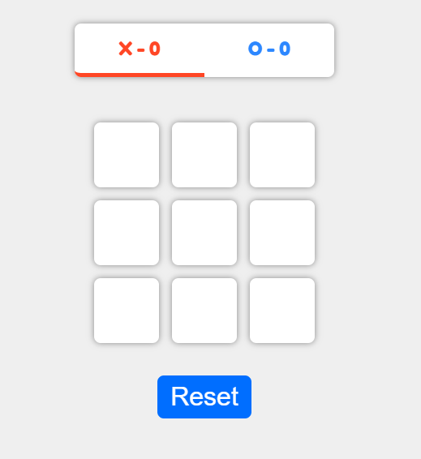

# Tic-Tac-Toe in React

## Preview Game :)




## 1.- Clona el repositorio de GitHub

```bash
git clone https://github.com/usuario/nombre-repositorio.git
```

Tambien puedes descargar el zip.

## 2.- Una vez dentro de la carpeta raíz del repositorio, ejecuta el siguiente comando para instalar las dependencias del proyecto:

```bash
npm install
```
Esto instalará todas las dependencias necesarias para la aplicación de React.

## 3.- Después de que se completen las instalaciones, ejecuta el siguiente comando para iniciar la aplicación:

```bash
npm start
```

Esto iniciará tu servidor de desarrollo y abrirá la aplicación en tu navegador predeterminado. También se actualizará automáticamente cada vez que realices cambios en el código fuente de la aplicación.


